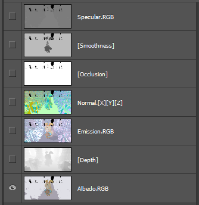

# FrameCapturer
[English](https://translate.google.com/translate?sl=ja&tl=en&u=https://github.com/unity3d-jp/FrameCapturer/) (by Google Translate)

フレームバッファの内容をキャプチャして画像や動画に出力する Unity 用のプラグインです。アニメ gif, mp4, exr への出力に対応しています。現在は Windows 専用となっています。(ソースレベルでは Mac や Linux でもビルドできて動くはずですが、未確認です)  
使用するにはまずこのパッケージをプロジェクトにインポートしてください: [FrameCapturer.unitypackage](https://github.com/unity3d-jp/FrameCapturer/blob/master/Packages/FrameCapturer.unitypackage?raw=true)  
以下は各コンポーネントの説明になります。
- [Gif Capturer](#gif-capturer)
- [MP4 Capturer](#mp4-capturer)
- [Exr Capturer](#exr-capturer)


## Gif Capturer
ゲーム画面をキャプチャしてアニメ gif としてエクスポートします。
常時録画して後で面白いカットを切り出してファイルに出力する、というような使い方を想定しています。録画解像度はかなり小さめ (横 300 pixel 程度) を推奨しています。解像度に比例してすごい勢いで処理が重くなるため、等倍での録画をリアルタイムで行うのは絶望的です。

以下のような機能を備えています。
- 直近 N フレームをメモリに残し、後で指定部分だけをファイルに出力 (=ShadowPlay や PS4 と似た録画方法)
- 非同期＆並列エンコーディング (メインスレッドをブロックしない)
- 簡単な in-game プレビューア＆エディタ
- D3D9, D3D11, OpenGL と x86, x86-64 の組み合わせに対応 (ただし Windows でのみ動作を確認)
- Twitter へ録画結果をゲーム内から直接投稿

以下の動画を見ると何ができるのか大体わかると思います。  
[](http://www.youtube.com/watch?v=VRmVIzhxewI)  

以下はこのプラグインで出力されたアニメ gif の例です。  
  

### 使い方
1. 録画したいカメラに GifCapturer コンポーネントを追加
2. uGUI オブジェクト GifCapturerHUD.prefab をどこかに配置し、それの capturer に 2 で追加したコンポーネントを設定

2 は必須ではありませんが、GifCapturer には録画の on/off 切り替えやファイルへの書き出しなどをコントロールするための GUI やスクリプトが必要になります。
GifCapturerHUD.prefab は機能はともかく見た目は必要最小限のため、これを使う場合も独自に改良した方がいいでしょう。

Twitter への投稿機能は、[TweetMedia](https://github.com/unity3d-jp/TweetMedia) によって実現されています。詳しくはそちらをご参照ください。  
TweetScreenshot.prefab はこちらのパッケージにしかない prefab で、録画した gif を添付する機能が追加された Tweet 用 GUI になっています。


## MP4 Capturer
ゲーム画面をキャプチャして mp4 動画で出力します。  現在実験段階であり、録音、編集、シークなどは未対応です。単純に動画としてキャプチャしてファイルに書き出すことのみできます。  
使い方は Gif Capturer とほぼ同じ (コンポーネントが MP4Capturer に変わっただけ) で、UI も GifCapturerHUD.prefab をそのまま使えます。  

**MP4Capturer を使用する場合、事前に OpenH264 の dll を別途入手してプラグインフォルダ (FrameCapturer.dll と同じフォルダ) に置く必要があります**。https://github.com/cisco/openh264/releases/tag/v1.5.0 このページから openh264-1.5.0-win32msvc.dll.bz2 openh264-1.5.0-win64msvc.dll.bz2 を入手、解凍してプラグインフォルダに置いてください。   
パッケージに含めていないのにはライセンス的な理由があります。
MP4 の使用には通常ライセンス料が課せられます。しかし、OpenH264 は特定の条件を満たしていればこのライセンス料を免除できるようになっています。その条件は以下のようなものです。

1. OpenH264 のバイナリはソフトウェア本体とは別にダウンロードするようになっている
2. ユーザーは OpenH264 を使用するか否かをコントロールできるようになっている
3. OpenH264 の使用をコントロールする場所に次の一文を明記してある: "OpenH264 Video Codec provided by Cisco Systems, Inc."
4. これらの条件のライセンスの条文 ( http://www.openh264.org/BINARY_LICENSE.txt 下部) が参照可能になっている

より正確には原文の方を参照ください: http://www.openh264.org/faq.html  
mp4 キャプチャ機能を備えたゲームをリリースしたい場合も、上記条件を満たさないとライセンス料を課せられる可能性が生じます。  
いずれ OpenH264 のダウンローダを用意して上記条件を満たしつつユーザーに簡単にインストールできるようにしようと思っています。  


## Exr Capturer  
Exr は主に映像業界で使われる画像フォーマットで、float や half のピクセルデータで構成された画像、いわゆる HDR 画像を保持できます。  
ExrCapturer は主に映像向けの用途を想定したもので、G-Buffer やマテリアル ID などを書き出し、コンポジットに使うことを目的としています。現状 G-Buffer の書き出しと、任意の RenderTexture の書き出しに対応しています。  
Exr エクスポートは非常に重く、リアルタイムで行うのは厳しい処理であるため、デルタタイムを固定して事前に指定しておいた範囲のフレームを書き出す、という使い方を想定しています。  

### 使い方

#### G-Buffer & フレームバッファのキャプチャ (ExrCapturer)
1. [このパッケージ](https://github.com/unity3d-jp/FrameCapturer/blob/master/Packages/FrameCapturer_Exr.unitypackage?raw=true)をインポート  
  (Exr は用途が特殊なため、専用パッケージになっています。また、64 bit 版のみの提供となります)
2. 録画したいカメラに ExrCapturer コンポーネントを追加
3. キャプチャしたい要素 (G-Buffer, FrameBuffer)、録画開始 / 終了フレームなどを設定し、Play  

  

Depth_format は、depth を 16 bit で書き出す場合 Half、32 bit で書き出す場合 Float を指定します。
depth は元データが 24 bit のため Float が望ましいのですが、編集ソフトが対応していない場合などに Half で書き出す必要性が生じます。

出力例:  
  

G-Buffer の出力は、デフォルトでは単一ファイルに多数のレイヤーを持たせる構成になっています。
以下は Photoshop に [ProEXR](http://www.fnordware.com/ProEXR/) を使って読み込んだ場合のレイヤー構成です。  
  

ファイルの分離やレイヤー名の変更を行いたい場合、ExrCapturer.cs の OnPostRender() 内のエクスポート部分を書き換える必要があります。
該当箇所のソースは以下のようになっており、書き換え自体は難しくないはずです。
```cs
FrameCapturer.fcExrBeginFrame(m_exr, path, m_gbuffer[0].width, m_gbuffer[0].height);
AddLayer(m_gbuffer[0], 0, "Albedo.R");
AddLayer(m_gbuffer[0], 1, "Albedo.G");
AddLayer(m_gbuffer[0], 2, "Albedo.B");
AddLayer(m_gbuffer[0], 3, "Occlusion");
AddLayer(m_gbuffer[1], 0, "Specular.R");
AddLayer(m_gbuffer[1], 1, "Specular.G");
AddLayer(m_gbuffer[1], 2, "Specular.B");
AddLayer(m_gbuffer[1], 3, "Smoothness");
AddLayer(m_gbuffer[2], 0, "Normal.X");
AddLayer(m_gbuffer[2], 1, "Normal.Y");
AddLayer(m_gbuffer[2], 2, "Normal.Z");
AddLayer(m_gbuffer[3], 0, "Emission.R");
AddLayer(m_gbuffer[3], 1, "Emission.G");
AddLayer(m_gbuffer[3], 2, "Emission.B");
AddLayer(m_depth, 0, "Depth");
FrameCapturer.fcExrEndFrame(m_exr);
```

---

#### RenderTexture のキャプチャ (ExrOffscreenCapturer)
1. パッケージをインポート (同上)
2. 録画したいカメラに ExrOffscreenCapturer コンポーネントを追加
3. RenderTexture を用意し、カメラと ExrOffscreenCapturer に設定

大体 ExrCapturer と同じですが、3 の RenderTexture を ExrOffscreenCapturer に設定する手順がやや複雑です。  
exr はピクセルの各チャンネル (RGBA) を個別にレイヤーとして持つ構造になっています。
これに合わせ、ExrOffscreenCapturer もチャンネル単位で書き出す要素を指定するようになっています。

Targets は 1 要素が 1 つの RenderTexture に対応します。
書き出したい数だけ Size を増やし、それぞれ Target に RenderTexture を指定します。  
Channnels にチャンネル情報を指定します。
Name は他とかぶっていなければなんでもよく、これがそのまま編集ソフトから見えるレイヤー名になります。
Channel は何番目のチャンネルかを指定するもので、0,1,2,3 がそれぞれ R,G,B,A に対応します。  

例: 1 つの RenderTexture の RGBA 各要素を書き出したい場合、以下のような設定になります。(ExrOffscreenCapturerExample.unity からの抜粋)  
  


## Thanks
- gif エクスポートに Jon Olick 氏の GIF Writer に手を加えたものを使用しています。オリジナルからの主な変更点は、出力先をファイルからメモリに変えたことです。  
  - オリジナル: http://www.jonolick.com/home/gif-writer  
  - fork: https://github.com/unity3d-jp/FrameCapturer/blob/master/Plugin/external/jo_gif.cpp
- mp4 エクスポートに以下のライブラリ群を使用しています。
  - OpenH264 http://www.openh264.org/
  - libyuv https://code.google.com/p/libyuv/
  - FAAC http://www.audiocoding.com/faac.html  
  - libcurl (OpenH264 ダウンローダに使用) http://curl.haxx.se/libcurl/
  - bzip2 (OpenH264 ダウンローダに使用) http://www.bzip.org/
- exr エクスポート以下のライブラリ群を使用しています。
  - OpenEXR http://www.openexr.com/  
  - ZLib http://www.zlib.net/  
- Twitter への投稿に TweetMedia を使用しています。  
  - https://github.com/unity3d-jp/TweetMedia

## License
MIT License:

  Copyright (C) 2015 Unity Technologies Japan, G.K.

  Permission is hereby granted, free of charge, to any person obtaining a copy of this software and associated documentation files (the "Software"), to deal in the Software without restriction, including without limitation the rights to use, copy, modify, merge, publish, distribute, sublicense, and/or sell copies of the Software, and to permit persons to whom the Software is furnished to do so, subject to the following conditions: The above copyright notice and this permission notice shall be included in all copies or substantial portions of the Software.

  THE SOFTWARE IS PROVIDED "AS IS", WITHOUT WARRANTY OF ANY KIND, EXPRESS OR IMPLIED, INCLUDING BUT NOT LIMITED TO THE WARRANTIES OF MERCHANTABILITY, FITNESS FOR A PARTICULAR PURPOSE AND NONINFRINGEMENT. IN NO EVENT SHALL THE AUTHORS OR COPYRIGHT HOLDERS BE LIABLE FOR ANY CLAIM, DAMAGES OR OTHER LIABILITY, WHETHER IN AN ACTION OF CONTRACT, TORT OR OTHERWISE, ARISING FROM, OUT OF OR IN CONNECTION WITH THE SOFTWARE OR THE USE OR OTHER DEALINGS IN THE SOFTWARE.
